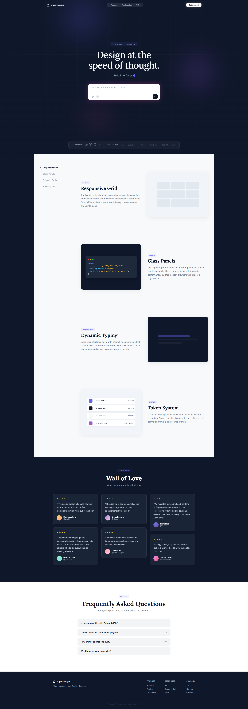

# 📚 ResearchRAG — Retrieval-Augmented Generation Research Assistant


> **Fusion: LLM + Information Retrieval + Vector Databases**



A production-grade RAG pipeline for academic research, featuring document ingestion (PDF, ArXiv, web), hybrid search (dense + sparse vectors), citation tracking, multi-hop reasoning, and hallucination detection.

## ✨ Features

- **Multi-format Ingestion** — PDF, ArXiv, web pages, DOI lookup
- **Hybrid Search** — Dense embeddings (OpenAI/sentence-transformers) + BM25 sparse retrieval
- **Vector Stores** — ChromaDB, FAISS, Pinecone adapters
- **Citation Tracking** — Auto-generates citations with page numbers
- **Multi-hop Reasoning** — Chain-of-thought with iterative retrieval
- **Hallucination Detection** — Cross-references answers with source chunks
- **Conversation Memory** — Context-aware follow-up queries

## 🚀 Quick Start

```bash
pip install -r requirements.txt
python -m src.main ingest --source ./papers/ --type pdf
python -m src.main query "What are the latest advances in RLHF?"
```

## 📦 Structure

```
ResearchRAG/
├── src/
│   ├── main.py
│   ├── ingestion/
│   │   ├── pdf_parser.py
│   │   ├── arxiv_fetcher.py
│   │   └── chunker.py
│   ├── embeddings/
│   │   ├── embedding_engine.py
│   │   └── hybrid_search.py
│   ├── vectorstore/
│   │   ├── chroma_store.py
│   │   └── faiss_store.py
│   ├── retrieval/
│   │   ├── retriever.py
│   │   └── reranker.py
│   ├── generation/
│   │   ├── generator.py
│   │   └── hallucination_detector.py
│   └── memory/
│       └── conversation.py
├── config/
├── requirements.txt
└── LICENSE
```
